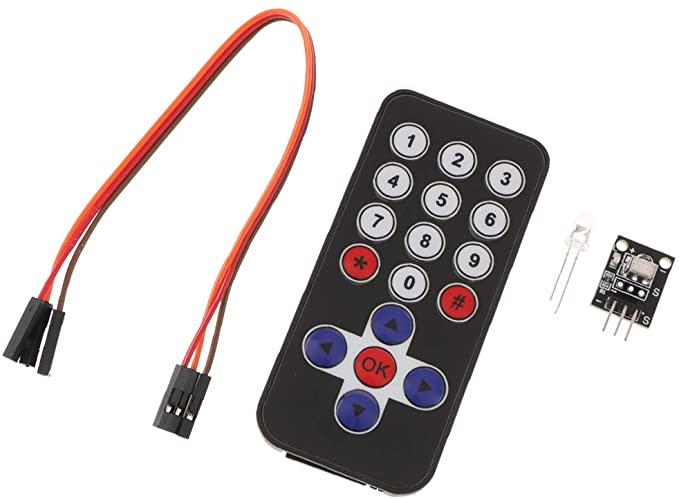

# ir_rcvr
This program reads a Huimai IR fob keypad via the IR receiver.

Note:
I bouught something similar from Buyapi, but it's not a Keyes IR keypad and receiver. Instead it's some knock off made by Huamai as best as I could tell. 

The receiver is not as shown: instead, the IR package is reversed, and the receiver side of the IR package faces the pins rather than facing away from the pins.

## Wiring for mini board
S side = "1"

1: 3.3V (GPIO 1) (white)  
2: Signal (GPIO 17) (black)  
3: GND  (GPIO 6) (brown)  
